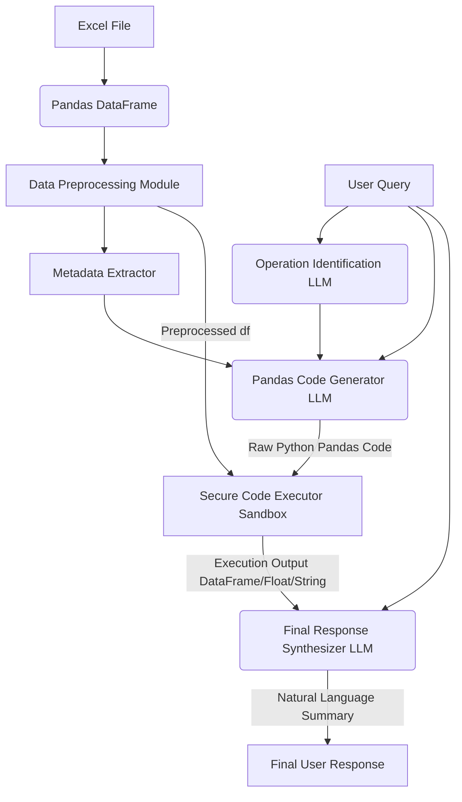

# Pandas LLM Pipeline: Architecture and Method Approach

This document provides a comprehensive overview of the end-to-end architecture, step-by-step methodology, and expected outcomes for the Pandas LLM pipeline solution.

## 1. System Architecture Flow

The pipeline is split into an initialization phase and a query execution phase, driven by the `PandasLLMPipeline` Python class.



## 2. Method Approach

The robust solution relies on prompt-chaining and strict boundary definitions to avoid hallucinations and execute data extraction deterministically.

**Step 1. Excel Preprocessing and Metadata Generation**
- **Action**: Load the `xlsx` file. Drop any purely empty rows/columns (all NaN). Strip whitespace around strings to ensure normalized matching.
- **Output**: The core Pandas DataFrame and a metadata JSON containing the column names, datatypes, and a valid unique value sample size for each column.
- **Why**: Providing column schema and representative values helps the LLM write accurate query logic without hallucinating column names or misinterpreting categorical text.

**Step 2. LLM Operation Identification**
- **Action**: Pass the user query to the LLM (GPT-4 / Gemini) and prompt it to categorize the required data operations.
- **Constraint**: It is strictly instructed to classify only operations analogous to standard SQL semantics (e.g., SELECT-like aggregation, WHERE filtering, GROUP BY, ORDER BY).

**Step 3. LLM Pandas Code Generation**
- **Action**: Using the query, the identified operations from Step 2, and the schema metadata from Step 1, prompt the LLM to write raw Python code operating on an existing `df` variable.
- **Constraint**: Must use *only* Pandas syntax. Must not include Markdown. Must save its final answer into a predefined variable named `result`.

**Step 4. Safe Local Code Execution**
- **Action**: The raw generated code string is dynamically compiled using Python's `exec()`. 
- **Constraint**: `exec()` is scoped and restricted using a heavily sanitized dictionary of local variables, providing access *only* to the `df` DataFrame and the `pandas` library. File access, OS capabilities, or API calls from the dynamically generated code are blocked as they are out of the locals namespace scope.
- **Result Output**: The local variable `result`.

**Step 5. Final LLM Response Synthesis**
- **Action**: Send the original user query and a string representation of the `result` obtained from Step 4 back to the LLM. 
- **Constraint**: Prompt the model to act as a data analyst answering the user cleanly based *only* on the provided extracted data, without showing them python logic or raw data structures.

## 3. Anticipated Results

When executed successfully against a query (e.g., *"What is the total revenue for Completed orders in the North region?"*), the state flows as follows:

1. **Metadata Extracted**: Shows column `Region` with valid values `['North', 'South'...]` and `Status` with `['Completed', 'Pending'...]`.
2. **Operations Identified**: `"Conditional Filtering (WHERE), Aggregation (SUM), Mathematical Operation (*)"`
3. **Generated Code**:
   ```python
   filtered_df = df[(df['Region'] == 'North') & (df['Status'] == 'Completed')]
   result = (filtered_df['Quantity'] * filtered_df['UnitPrice']).sum()
   ```
4. **Execution Sandbox**: The script executes over the mock mock DataFrame and returns a single float like `4523.50`.
5. **Final output to User**: *"The total revenue for Completed orders in the North region is $4,523.50."*
