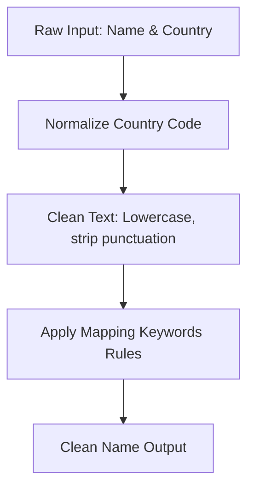
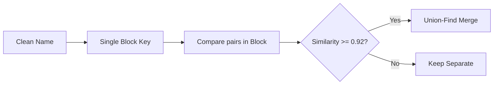
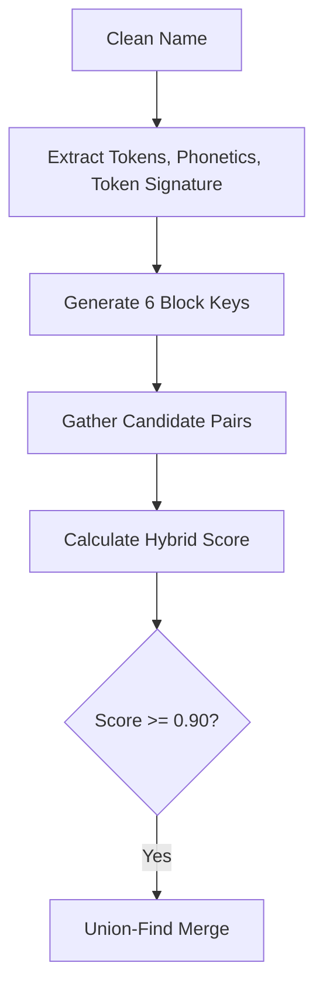
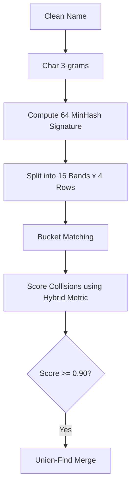
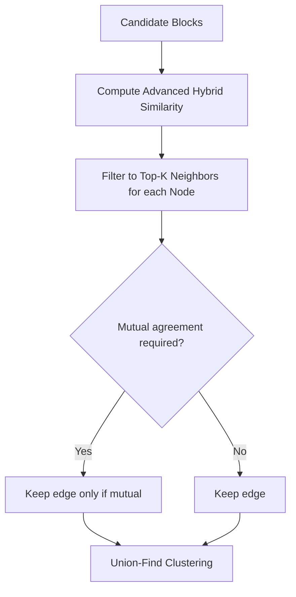

# End-to-End Name Matching and Clustering Methods

This document provides a comprehensive, end-to-end breakdown of the five distinct name clustering and record matching methods implemented in this repository. These methods are designed to process, deduplicate, and cluster unmatched customer or company name records (`Nomatch_all_records.csv`) using country-specific domain knowledge (`Mapping_Keywords.xlsx`).

---

## 📊 Summary of Clustering Results (10,000 Records)

Using the execution results compiled in [clustering_approach_comparison.csv](file:///C:/Users/gugul/Downloads/Matching/clustering_approach_comparison.csv), here is a summary of how the approaches stack up:

| Method | Rows Processed | Total Clusters | Clusters with 2+ Records | Records in 2+ Clusters | Single Records (Unmatched) | Max Cluster Size | Has Match Scores / Reasons |
| :--- | :---: | :---: | :---: | :---: | :---: | :---: | :---: |
| **1. Basic Clustering** | 10,000 | 9,251 | 471 | 1,220 | 8,780 | 21 | No / No |
| **2. Advanced Clustering** | 10,000 | 9,236 | 482 | 1,246 | 8,754 | 21 | Yes / Yes |
| **3. TF-IDF character N-gram** | 10,000 | 9,254 | 468 | 1,214 | 8,786 | 21 | Yes / Yes |
| **4. LSH MinHash** | 10,000 | 9,227 | 485 | 1,258 | 8,742 | 21 | Yes / Yes |
| **5. KNN-Style Graph** | 10,000 | 9,236 | 482 | 1,246 | 8,754 | 21 | Yes / Yes |
| **Ensemble (Consensus)** | 10,000 | 9,236 | 482 | 1,246 | 8,754 | 21 | Yes / Yes |

---

## 🛠️ Global Preprocessing & Standardization Pipeline

All 5 methods share a standardized preprocessing foundation to ensure consistency:

1. **Country Normalization**: Converts raw country inputs (e.g., `"united states"`, `"USA"`, `"Canada"`) into normalized codes (`"us"`, `"ca"`).
2. **Standard Punctuation Removal**: Lowercases the name, replaces non-alphanumeric characters with spaces, and strips leading/trailing spaces.
3. **Domain Suffix Replacements**: Loads substitution rules from [Mapping_Keywords.xlsx](file:///C:/Users/gugul/Downloads/Matching/Mapping_Keywords.xlsx) (e.g., mapping `"ltd"`, `"co"`, `"inc"` to empty string or specialized forms based on country). Longer terms are matched first to prevent partial replacements.

---

## 1️⃣ Method 1: Basic Clustering (Single-Key Blocking & Fuzzy Matching)
*Implemented in: [cluster_nomatch_records.py](file:///C:/Users/gugul/Downloads/Matching/cluster_nomatch_records.py)*

### 🔍 Algorithm Overview
* **Blocking Strategy**: Generates a single block key from the cleaned name.
  * If multi-word: `first5chars_second4chars` (e.g., `"google corporation"` $\rightarrow$ `"googl_corp"`)
  * If single-word: `first6chars` (e.g., `"google"` $\rightarrow$ `"google"`)
* **Similarity Metric**: Character-level Edit Distance ratio via Python's built-in `difflib.SequenceMatcher.ratio()`.
* **Clustering Mechanism**: Transitive grouping via connected components (Union-Find) restricted within each blocking partition.

### 📋 End-to-End Steps
1. **Load Rules**: Extract country rules from sheet `Sheet1` of `Mapping_Keywords.xlsx`.
2. **Standardize Name**: Lowercase name, apply regex punctuation cleaning, and replace keywords.
3. **Block Key Generation**: Generate a single `block_key` for each record.
4. **Exact Phase**: Group and merge records sharing the exact same normalized country and clean name.
5. **Fuzzy Phase**: Within each block key (limiting block size to $\le 250$), calculate pairwise similarity:
   * Reject match if numeric tokens are present and do not match exactly.
   * Reject match if word tokens are present but have zero overlap.
   * Accept match if `SequenceMatcher.ratio() >= 0.92`.
6. **Union-Find Grouping**: Output the final clusters.

---

## 2️⃣ Method 2: Advanced Hybrid Clustering (Multi-Key Blocking & Hybrid Similarity)
*Implemented in: [advanced_nomatch_clustering.py](file:///C:/Users/gugul/Downloads/Matching/advanced_nomatch_clustering.py)*

### 🔍 Algorithm Overview
* **Blocking Strategy**: Multi-key candidate generation. Generates up to 6 distinct block keys per record to capture out-of-order words, typos, and abbreviations:
  1. Exact Name: `('exact', country, clean)`
  2. Token Signature: `('signature', country, sorted_unique_tokens)`
  3. First & Second Token prefix: `('first_second', country, first_tok[:5], second_tok[:5])`
  4. First & Last Token prefix: `('first_last', country, first_tok[:5], last_tok[:5])`
  5. First Token prefix: `('first_token', country, first_tok[:6])`
  6. Phonetic Block: `('phonetic', country, Soundex_signature)`
* **Similarity Metric**: Hybrid combination of four metrics:
  1. **Jaccard Token Similarity**: Word overlap fraction.
  2. **Token Containment**: Percentage of tokens in the smaller name that appear in the larger name (handles abbreviations/subsets like `"Apple"` vs `"Apple Technology Corp"`).
  3. **SequenceMatcher**: Character-level edit distance ratio.
  4. **Token Sort Ratio**: SequenceMatcher similarity of sorted token signatures.
* **Hybrid Scoring Formula**:
  $$\text{Score} = \max \left( \text{Exact}, \text{Signature}, (0.50 \times \text{Jaccard} + 0.30 \times \text{SequenceMatcher} + 0.20 \times \text{TokenSort}), (0.60 \times \text{Containment} + 0.40 \times \text{SequenceMatcher}) \right)$$

### 📋 End-to-End Steps
1. **Feature Extraction**: Remove stop words (e.g., `"the"`, `"and"`), stem plurals (e.g., `"ies"` $\rightarrow$ `"y"`), compute Soundex codes, token signatures, and acronyms.
2. **Candidate Bucketing**: Map records to their 6 multi-key blocks.
3. **Pairwise Scoring**: Compare candidate pairs inside blocks (size $\le 350$):
   * Enforce numeric agreement.
   * Compute hybrid score.
4. **Union-Find Clustering**: Merge pairs with scores $\ge 0.90$. Flag pairs between $[0.84, 0.90)$ as `near_match_review` for manual audit.

---

## 3️⃣ Method 3: TF-IDF N-Gram Blocking & Cosine Similarity
*Implemented in: [tfidf_blocking_unionfind_clustering.py](file:///C:/Users/gugul/Downloads/Matching/tfidf_blocking_unionfind_clustering.py)*

### 🔍 Algorithm Overview
* **Blocking Strategy**: Same multi-key candidate blocking as Method 2.
* **Vector representation**: Splits clean names into character 3-grams and 4-grams (e.g., `"abc"` $\rightarrow$ `[' ab', 'abc', 'bc ']` with edge padding).
* **Similarity Metric**: Cosine similarity of TF-IDF weighted character n-gram vectors.
* **Clustering Mechanism**: Union-Find, keeping only the top-$K$ (default 5) nearest neighbors for each node.

### 📋 End-to-End Steps
1. **Construct Blocks**: Assign records to candidate blocks.
2. **TF-IDF Vectorization**: Within each block partition:
   * Build document frequencies of all character 3,4-grams.
   * Compute TF-IDF score for each n-gram.
   * L2-normalize vectors.
3. **Similarity Filter**: Compare pairs and check if `CosineSimilarity >= 0.86`. Require exact numeric digit agreement.
4. **Top-K Selection**: For each record, keep only connections to its top-5 nearest neighbors.
5. **Clustering**: Perform Union-Find clustering on the top-K neighbor edges.

---

## 4️⃣ Method 4: Locality Sensitive Hashing (LSH) & MinHash Clustering
*Implemented in: [lsh_minhash_unionfind_clustering.py](file:///C:/Users/gugul/Downloads/Matching/lsh_minhash_unionfind_clustering.py)*

### 🔍 Algorithm Overview
* **Blocking Strategy**: LSH buckets.
  * Names are split into character 3-grams (shingles).
  * 64 hash permutations compute a 64-integer MinHash signature.
  * The signature is divided into $B=16$ bands, with $R=4$ rows per band.
  * Records are bucketed by `(band_index, sub_signature)`.
* **Similarity Metric**: If two records collide in any of the 16 bands, they are compared using the Advanced Hybrid Similarity score (from Method 2).
* **Clustering Mechanism**: Union-Find on pairs exceeding the threshold.

### 📋 End-to-End Steps
1. **Shingling**: Generate overlapping 3-character shingles for each clean name.
2. **MinHashing**: Generate 64-perm signatures via seeded stable hashes (using `hashlib.blake2b`).
3. **LSH Banding**: Split signatures into 16 bands. Place record IDs into buckets.
4. **Candidate Extraction**: Retrieve pairs sharing a bucket in the same country.
5. **Hybrid Verification**: Compare candidates using the Advanced Hybrid Similarity metric.
6. **Clustering**: Cluster matches with similarity $\ge 0.90$ using Union-Find.

---

## 5️⃣ Method 5: KNN-Style Similarity Graph & Union-Find Clustering
*Implemented in: [knn_style_nomatch_clustering.py](file:///C:/Users/gugul/Downloads/Matching/knn_style_nomatch_clustering.py)*

### 🔍 Algorithm Overview
* **Blocking Strategy**: Same multi-key blocking as Method 2.
* **Similarity Metric**: Advanced Hybrid Similarity metric.
* **Graph Modeling**: Builds a similarity graph where nodes are only connected to their top-$K$ (default 3) nearest neighbors (optionally requiring mutual KNN connection).
* **Clustering Mechanism**: Union-Find on the filtered KNN edges.

### 📋 End-to-End Steps
1. **Blocking**: Assemble candidate pairs using multi-key blocks.
2. **Pairwise Hybrid Scoring**: Compute advanced hybrid similarity scores for candidate pairs.
3. **Top-K Truncation**: For each node, rank its neighbors and keep only the top-3.
4. **Mutuality Constraint (Optional)**: If `require_mutual=True`, only keep edges between node A and B if B is in A's top-3 list and A is in B's top-3 list.
5. **Clustering**: Run Union-Find on the remaining graph edges to produce clusters.

---

## 🤝 Bonus: Ensemble Voting (Consensus Method)
*Implemented in: [ensemble_nomatch_clustering.py](file:///C:/Users/gugul/Downloads/Matching/ensemble_nomatch_clustering.py)*

### 🔍 Algorithm Overview
Rather than relying on a single algorithm, the Ensemble method acts as a meta-classifier:
1. Gathers clustered pair matches from **Basic**, **Advanced**, and **KNN-Style** methods.
2. For each unique pair of records, counts how many methods placed them in the same cluster.
3. Unions a pair of records if at least **2 out of 3** models agree they are a match.
4. Provides high consensus precision while capturing the coverage of multiple methods.
