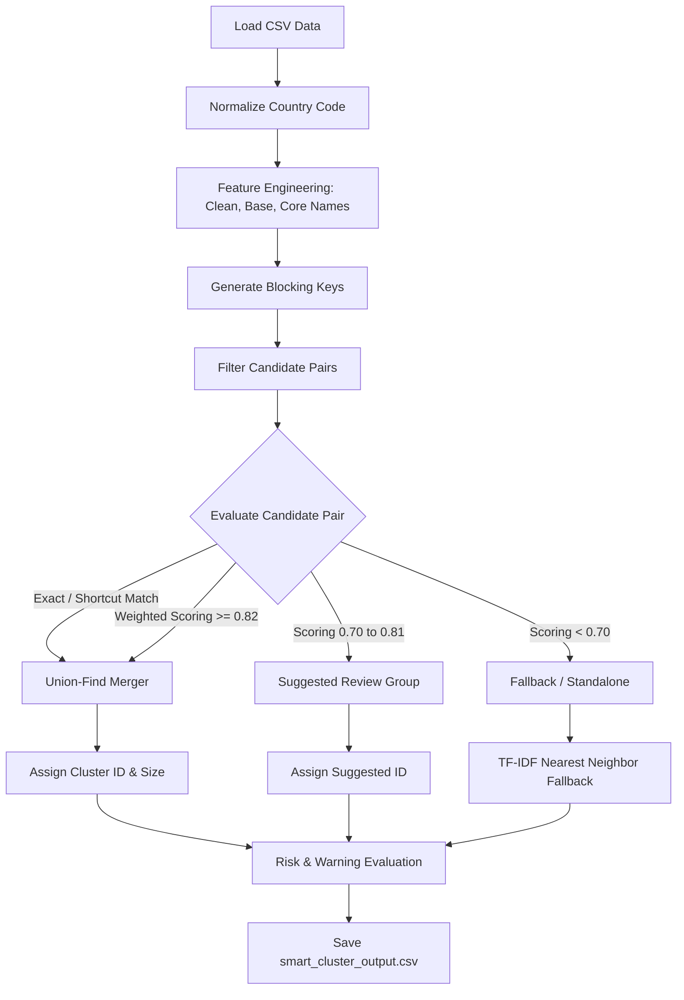

# Smart Company Name Clustering: Presentation Notes

This document provides a comprehensive, end-to-end technical explanation of the **Smart Company Name Clustering** pipeline (`smart_cluster.py`). It is designed as a guide/cheat sheet for presenting the pipeline, explaining how it works, how it matches names, and how it scales to large datasets.

---

## 1. Executive Summary / Slide 1: Introduction

*   **Problem Statement**: Company names are messy. They contain typos, varying word orders, different legal suffixes (LLC vs. Corp vs. Inc.), and extraneous info (reference numbers, person names). Standard exact matching misses almost all of these variations, while a brute-force pairwise comparison ($O(N^2)$) does not scale to large datasets.
*   **Solution**: A hybrid, scalable name resolution pipeline that uses:
    1.  **Multi-level Text Normalization** (generating Clean, Base, and Core representations).
    2.  **Deterministic Blocking Keys** to filter candidates and bypass all-against-all comparison.
    3.  **Composite Ensemble Scoring** (heuristics, regex shortcuts, and a weighted similarity model).
    4.  **Union-Find (Disjoint Set)** clustering to group matching names transitively.
    5.  **Quality & Review Framework** highlighting risky groups and recommending human-in-the-loop validation categories.

---

## 2. Technical Architecture: End-to-End Pipeline

---

## 3. Step-by-Step Breakdown

### Stage 1: Country Normalization
*   **Why?** Names should only match if they operate in the same country (e.g., "Coca-Cola US" is distinct from "Coca-Cola Germany" for tax or business entity mapping).
*   **How**: Standardizes country strings into normalized two-letter codes (e.g., `United States` or `USA` $\rightarrow$ `us`, `United Kingdom` or `UK` $\rightarrow$ `gb`).

### Stage 2: Feature Engineering & Representations
To make matching robust, the pipeline extracts three representations for every raw name:

| Representation | Purpose | Example (`raw`: `"KLA - BO-YANG WU LLC"`) |
| :--- | :--- | :--- |
| **Clean Name** | Normalizes characters, removes punctuation, HTML codes, and noise tokens. | `"kla bo yang wu llc"` |
| **Base Name** | Strips delimited suffixes (like hyphenated person names or ticket numbers). | `"kla"` |
| **Core Name** | Removes legal entity tokens (like LLC, Inc, Ltd, GmbH). | `"kla"` |

*   **Noise Token Filtering**: Rejects tokens consisting purely of digits or mixed letters-digits that resemble internal tickets, POs, or tracking IDs (e.g., `RITM004767`, `WO00001234`, `0665ab`).
*   **Legal Suffix Stripping**: Uses a dictionary of common global suffixes (`_SUFFIX_TOKENS`) and common expressions (`_LEGAL_PHRASES`) to dynamically shave off suffixes without hardcoded company lists.

---

## 4. The Matching Strategy (Ensemble & Heuristics)

The pipeline scores pairs of candidate records with a value between `0.0` and `1.0`.

### A. Fast-Path Shortcuts
If a pair matches on structural representations, they bypass the slow calculation:
*   **Exact Clean Match**: Score `1.0` (Reason: `exact_clean`)
*   **Exact Base Match**: Score `1.0` (Reason: `same_base`) - *e.g., "Microsoft - John Doe" and "Microsoft - Jane Smith" base-match to "Microsoft".*
*   **Exact Core Match**: Score `0.97` (Reason: `same_core`) - *e.g., "Microsoft Corp" vs "Microsoft LLC".*

### B. Defensive Guardrails
*   **Number Guard**: If one name contains numbers (e.g. `"Unified School District 445"`) and the other contains different numbers (e.g. `"Unified School District 123"`), the score is **instantly set to `0.0`** (`number_mismatch`). This prevents false matches across numbered divisions.

### C. Containment Shortcuts
*   **Containment Check**: If one name is a subset prefix of another (e.g., `"General Electric"` vs `"General Electric Capital Services"`), they are scored highly (between `0.88` and `0.95`) provided they share strong distinctive identity words.

### D. Composite Ensemble Score (Weighted Blend)
For pairs that require detailed evaluation, the pipeline computes a weighted ensemble score:

$$\text{Composite Score} = (0.40 \times \text{Token Jaccard}) + (0.30 \times \text{Character Similarity}) + (0.20 \times \text{Token Containment}) + (0.10 \times \text{Phonetic Match})$$

*   **Token Jaccard** (Weight: **40%**): Measures word-level overlap regardless of order (e.g., `"Services Technology Systems"` vs `"Systems Technology Services"` $\rightarrow$ `1.0`).
*   **Character Similarity** (Weight: **30%**): Standard Python `SequenceMatcher` ratio computed across different core representations to catch typos (e.g., `"Mcrosoft"` vs `"Microsoft"`).
*   **Token Containment** (Weight: **20%**): Measures the proportion of words in the shorter name that exist (or closely match) in the longer name.
*   **Phonetic Matching** (Weight: **10%**): A customized Soundex algorithm key mapping the first two tokens (e.g., `"Acon"` and `"Aecon"` map to similar phonetic signatures).

---

## 5. Scaling Strategy: Blocking (Avoiding $O(N^2)$)

Comparing $10,000$ rows against each other results in $50,000,000$ comparisons. For $100,000$ rows, it's $5,000,000,000$ comparisons!
To scale, we use **Blocking**: rows are indexed by multiple "cheap" keys. We only score rows that share at least one blocking key.

### Blocking Keys Used:
1.  **Exact clean, base, and core representations**.
2.  **Sorted Token Signature**: Words sorted alphabetically (resolves word order variations).
3.  **Prefix-based Keys**: First two tokens + last token.
4.  **Token Pairs**: Combinations of two meaningful words (length $\ge 4$).
5.  **Phonetic Signatures**: Soundex representations of the first two tokens.

*   *Guardrail*: If a block contains more than `350` records (e.g., a generic word like "Global" or "Systems"), it is skipped (`MAX_BLOCK_SIZE` check) to prevent combinatoric explosion.

---

## 6. Clustering Engine: Union-Find (Disjoint-Set)

Once pairs are scored and accepted (Score $\ge 0.82$), they are clustered using the **Union-Find** algorithm.
*   **How it works**: Union-Find maintains partition sets. When we accept a match between `A` and `B`, we union their groups.
*   **Transitivity (Chaining)**: If `A` matches `B` (e.g., score `0.85`), and `B` matches `C` (e.g., score `0.90`), Union-Find groups `A`, `B`, and `C` into the same cluster automatically.
*   **Time Complexity**: Nearly $O(N)$ (specifically, $O(N \cdot \alpha(N))$ where $\alpha$ is the inverse Ackermann function, which is effectively constant for all practical dataset sizes).

---

## 7. Quality Control & Human-in-the-Loop Workflow

Instead of a black box that just outputs clusters, the code classifies results into distinct **Review Categories** to streamline human review:

| Review Category | Explanation | Needs Action? |
| :--- | :--- | :--- |
| `standalone` | No matching candidates found. | **No** |
| `exact_duplicate_rows` | Repeated rows with the exact same cleaned name. | **No** (Automatic cluster) |
| `name_variation_cluster` | Clustered names with distinct variations (e.g., `"Google LLC"` & `"Google Inc"`). | **Optional Review** |
| `warning_cluster` | Cluster matches that trigger risk thresholds (e.g., too short, ticket codes, only generic words like "Group Services"). | **Yes (High Risk)** |
| `suggested_match_cluster` | Names that are close but fell below the matching threshold (between `0.70` and `0.82`). | **Yes (Review Group)** |
| `possible_missed_match` | Standalone rows that have a close neighbor in TF-IDF space just below threshold. | **Yes** |

### Automated Risk Warnings:
A cluster is flagged as a `warning_cluster` if it matches any of these conditions:
1.  **`reference_or_ticket_pattern`**: Raw text contains patterns like RITM/WO/TASK codes.
2.  **`too_little_clean_company_text`**: Short names that are prone to accidental collisions.
3.  **`only_generic_descriptor_tokens`**: Matches consisting only of generic industry words (e.g. `"Management Services"`).
4.  **`weak_shared_identity_tokens`**: Clusters linked via containment but sharing very little distinctive brand text.

---

## 8. Data Dictionary for CSV Columns

When showing the CSV output to business stakeholders or developers, these are the key columns to highlight:

| Column Name | Type | Description |
| :--- | :--- | :--- |
| `ToMatch_Name` | String | Original input name. |
| `clean_name` / `core_name` | String | Normalized, suffix-stripped name representations. |
| **`cluster_id`** | String | Final cluster identifier (`C...` for clusters, `S...` for standalones). |
| `confidence` | String | confidence classification (`high`, `medium`, `single`). |
| **`review_category`** | String | Actionable workflow class (e.g., `warning_cluster`, `possible_missed_match`). |
| **`needs_team_review`** | Boolean | Flag (`True`/`False`) indicating if manual validation is recommended. |
| `review_note` | String | Plain-English instruction explaining why the row was flagged. |
| `closest_match_name` | String | The name of the closest candidate evaluated, for visual comparison. |
| `closest_match_score_percent` | Float | Score of the closest candidate (0.0 to 100.0%). |

---

## 9. Presentation Guide / Talking Points

Here is a recommended talking structure for your presentation:

1.  **Introduce the Problem**: Show examples of messy company names in the source data. Explain why simple string matching fails (e.g., `Hewlett Packard` vs `Hewlett-Packard Corp` vs `HP`).
2.  **Explain the Scaling (Blocking)**: Explain that we cannot compare every name with every other name due to performance issues. Mention how blocking keys act as a "smart search index" that group candidate pairs by country.
3.  **Explain the Multi-Signal Scoring**: Show how the algorithm works like a human analyst:
    *   It checks for exact matches first (Clean, Base, Core).
    *   It blocks names with differing numbers (Number Guard).
    *   It checks for abbreviations and containment.
    *   It uses a weighted combination of character similarity, word overlap (Jaccard), and phonetics.
4.  **Show the Union-Find Advantage**: Explain how the algorithm chains matches together (A=B, B=C $\rightarrow$ A=B=C) without needing to compare A and C directly.
5.  **Demonstrate Review Categories (Crucial Slide)**: Point out that the pipeline does not force a final decision on risky/close cases. It flags them for review under `review_category` (like `warning_cluster` or `possible_missed_match`), allowing teams to easily audit the results using simple Excel filters.
