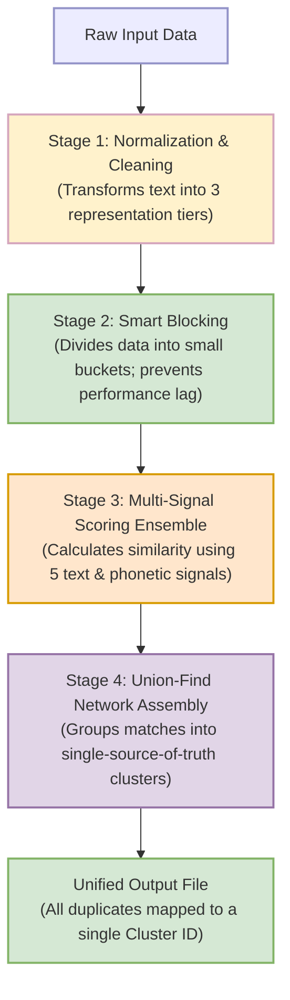
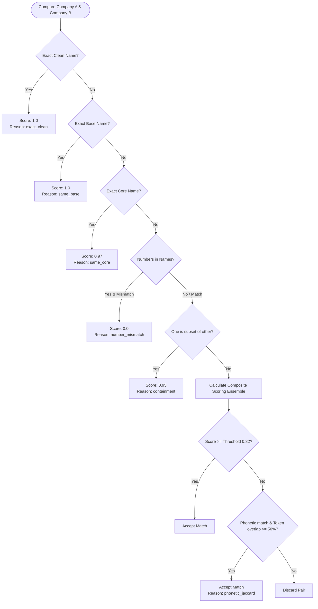
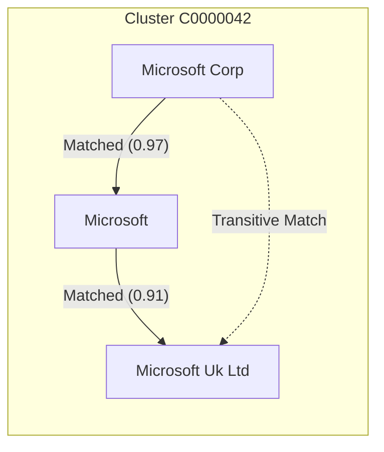

# Client Guide: Smart Company Name Clustering System

This document provides a comprehensive, non-technical and technical explanation of the **Smart Company Name Clustering System** (`smart_cluster.py`). Use this guide to explain to clients how the algorithm works, how it guarantees accuracy, why it runs fast on large datasets, and how they can tune it to their business needs.

---

## Executive Summary: What is Smart Clustering?

Organizations often struggle with messy, duplicate customer databases. The same company might be written in dozens of different ways due to typos, legal designations, human variations, or system logs:
* *Microsoft Corporation*
* *Microsoft Inc.*
* *MICROSOFT CORP - RITM04767882*
* *Microsoft (UK) Ltd*

A simple exact-match filter will treat these as separate companies. A naive comparison of every row against every other row (the $O(n^2)$ approach) would take hours or days to run on even a modest dataset. 

This **Smart Company Name Clustering System** solves this using a state-of-the-art **4-Stage Pipeline**:



---

## Stage 1: Data Normalization & Cleaning

Before comparing names, the system cleans them. It builds **three distinct representations** for every name to match different levels of granularity.

### The Cleaning Steps:
1. **Country Normalization**: Converts country names to ISO 2-letter codes (e.g., `"United States of America"` $\rightarrow$ `"us"`, `"United Kingdom"` $\rightarrow$ `"gb"`). Comparisons are isolated by country so we don't accidentally match *Apple US* with *Apple Germany*.
2. **ASCII Standardization**: Converts characters to ASCII, removing accents and special symbols (e.g., `Café` $\rightarrow$ `cafe`).
3. **Noise & ID Removal**: Dynamically strips ticket numbers, system references, and generic noise (e.g., `RITM04767882` or `WO00001234` are detected and discarded).
4. **Legal Phrase Stripping**: Removes common multi-word entity markers (e.g., `joint stock company`, `private limited`).

### The Three Representation Tiers:

* **Clean Name**: The fully standard, lowercased name without noise.
* **Base Name**: Separates and discards contact names or system tags appended with delimiters (like `-` or spaces).
* **Core Name**: The bare business name, stripped of all trailing legal suffixes (like `Corp`, `LLC`, `GmbH`, `S.A.`).

#### Real Examples:
| Original Input Name | country | Clean Name | Base Name | Core Name | Phonetic Key (Soundex) |
| :--- | :--- | :--- | :--- | :--- | :--- |
| **KLA - BO-YANG WU** | United States | `kla bo yang wu` | `kla` | `kla` | `K400` |
| **Coca-Cola Company** | Canada | `coca cola company` | `coca cola company` | `coca cola` | `C224_C400` |
| **Microsoft Corp** | Germany | `microsoft corp` | `microsoft corp` | `microsoft` | `M262` |
| **Microsoft (UK) Ltd** | UK | `microsoft uk ltd` | `microsoft uk ltd` | `microsoft uk` | `M262_U200` |

> [!NOTE]
> By tokenizing the **Core Name** instead of the Clean Name, we prevent legal suffixes (like "Ltd" or "Corp") from artificially boosting similarity scores.

---

## Stage 2: Smart Blocking (Why the System is Lightning Fast)

If we have **10,000 rows** of data:
* **Naive matching** compares every row against all others: $\frac{10,000 \times 9,999}{2} = \mathbf{49,995,000}$ comparisons. This scales exponentially ($O(n^2)$) and crashes for large files.
* **Smart Blocking** generates **hash keys** for every company name. The system only compares companies that share at least one hash key. If they don't share a key, they are skipped entirely.

### Blocking Keys Generated per Row:
1. **Exact Matches**: Shares exact `Clean`, `Base`, or `Core` names.
2. **Word Order Invariance (Signature)**: Alphabetically sorted words (e.g., `"Systems Cisco"` and `"Cisco Systems"` both generate the key `cisco systems`).
3. **Prefix Keys**: First 2 words, abbreviated (e.g., first 5 letters of the first two tokens).
4. **Phonetic Matching**: Soundex codes of the first two words (matches names that sound identical but are spelled differently).

> [!TIP]
> If a block size exceeds `MAX_BLOCK_SIZE = 400` (e.g., a common key like `"corp"` or `"services"`), it is automatically skipped to prevent massive slowdowns on generic terms.

---

## Stage 3: Multi-Signal Scoring Ensemble

When two candidate names share a blocking key, they are compared using a combination of fast checks and a weighted scoring engine.



### The Fast Paths (High-Confidence Matches)
* **Exact Clean Match (Score 1.0)**: `"Google"` vs `"Google"`
* **Same Base Name (Score 1.0)**: `"Sanofi - Jan Hansen"` vs `"Sanofi - Peter Hansen"` (strips the contact name, matches on "Sanofi")
* **Same Core Name (Score 0.97)**: `"Microsoft Corp"` vs `"Microsoft Ltd"`

### The Guardrail: Number Guard (Instant Reject)
If names contain digits (e.g., `"Boing 747"` vs `"Boing 777"`), and the digits do not match exactly, the system **instantly rejects** the pair (Score: 0.0). This prevents matching different product divisions, room numbers, or years.

### The Composite Scoring Engine (Weighted Ensemble)
For names that don't hit the fast paths, the system calculates a weighted score based on 4 distinct signals:

$$\text{Final Score} = (0.40 \times \text{Jaccard}) + (0.30 \times \text{SequenceMatcher}) + (0.20 \times \text{Containment}) + (0.10 \times \text{Phonetic})$$

1. **Token Jaccard (40%)**: Measures word overlap, ignoring order.
   * Example: `{"cisco", "systems"}` vs `{"systems", "cisco"}` $\rightarrow$ **1.0 (100% match)**.
2. **Character SequenceMatcher (30%)**: Measures edit distance (typos and spelling variations).
   * Example: `"Siemens"` vs `"Siemans"` $\rightarrow$ **0.86 (86% match)**.
3. **Containment (20%)**: Measures if one company name is completely inside a larger company name.
   * Example: `"Apple"` vs `"Apple Computer Group"` $\rightarrow$ **1.0 (100% containment)**.
4. **Phonetic Matching (10%)**: Measures if words sound identical.
   * Example: `"Philip"` vs `"Phillip"` $\rightarrow$ **1.0 (100% phonetic match)**.

---

## Stage 4: Union-Find (Group Assembly)

If Company A matches Company B (score $\ge 0.82$) and Company B matches Company C, are Company A and Company C in the same cluster? **Yes.**

The system uses **Union-Find**, a graph algorithm that groups connected nodes into single, unified networks (clusters). It resolves transitive relationships instantly:



Every record is assigned:
* A **Cluster ID**:
  * Starts with **`C`** (e.g., `C0000105`) if it has multiple matching records.
  * Starts with **`S`** (e.g., `S0000402`) if it is a standalone record (no duplicates found).
* A **Confidence Tier**:
  * **`high`**: Clustered records with high similarity scores ($\ge 0.95$).
  * **`medium`**: Clustered records with similarity scores between $0.82$ and $0.95$.
  * **`single`**: Standalone rows.

---

## Interactive Examples: How the System Behaves

Here are real scenarios showcasing how different edge cases are resolved:

### Example A: Typo Resolution
* **Input 1**: `Hewlett Packard Enterprise`
* **Input 2**: `Hewlet Packard Ent.`
* **Core Names**: `hewlett packard enterprise` vs `hewlet packard`
* **Signals**:
  * Jaccard: 67% overlap (2 out of 3 tokens match).
  * Character Ratio: 89% match.
  * Containment: 100% match ("Hewlet Packard" is contained in the other).
  * Phonetic: 100% match (Soundex keys match).
* **Final Score**: **0.88** $\rightarrow$ **Clustered together (Confidence: Medium)**.

### Example B: Subsidiary / Division Guardrail (With Numbers)
* **Input 1**: `General Electric Division 1`
* **Input 2**: `General Electric Division 2`
* **Number Guard**: Identifies `1` and `2`. Since $1 \neq 2$, the pair is immediately given a **0.0 score**.
* **Result**: **Kept separate (Standalone)**.

### Example C: Transitive Name Resolution
* **Input 1**: `Cisco Systems Inc`
* **Input 2**: `Cisco Systems`
* **Input 3**: `Cisco Corp`
* **System Actions**:
  * Input 1 matches Input 2 via **same core name** (`"cisco systems"`).
  * Input 2 matches Input 3 via **hybrid scoring** (very high token containment on "Cisco").
  * **Union-Find result**: All 3 are assigned to the exact same cluster ID (e.g., `C0000018`), listing `"Cisco Systems Inc | Cisco Systems | Cisco Corp"` as the grouped name list.

---

## Business Tuning Guide

Clients can adjust the behavior of the clustering system by editing the following parameters in `smart_cluster.py`:

```python
MATCH_THRESHOLD       = 0.82     # The master dial for matching sensitivity
MAX_BLOCK_SIZE        = 400      # Controls speed vs thoroughness
SAMPLE_SIZE           = 10_000   # Set to 0 to run the entire dataset
```

### 1. The Sensitivity Dial (`MATCH_THRESHOLD`)
* **Strict Matching (Threshold = 0.90)**:
  * *Use Case*: When false positives are highly damaging (e.g., merging financial records of different clients).
  * *Result*: Fewer clusters are formed. Only very obvious duplicates (slight typos, suffix variations) are grouped.
* **Balanced Matching (Threshold = 0.82 - Default)**:
  * *Use Case*: Standard CRM deduplication.
  * *Result*: Optimal balance between catching abbreviation mismatches and preventing false mergers.
* **Lenient Matching (Threshold = 0.75)**:
  * *Use Case*: Initial discovery or market research.
  * *Result*: Groups companies with loose relationships (e.g., matching `"Johnson & Johnson"` and `"Johnson Medical"`). Higher risk of false positives.

### 2. Speed Optimization (`MAX_BLOCK_SIZE`)
If the dataset is massive (e.g., 500,000+ rows):
* Lowering `MAX_BLOCK_SIZE` to `200` speeds up the script drastically by ignoring extremely broad buckets.
* Raising `MAX_BLOCK_SIZE` to `1000` evaluates more edge cases but will require more processing time.

---

## Output Fields Explained (How Clients Should Read the CSV)

When clients open the final `smart_cluster_output.csv`, they should focus on these columns:

| Column Name | Business Description | How to Use |
| :--- | :--- | :--- |
| `cluster_id` | Unique ID for the company group. | Sort by this column to see all duplicate rows grouped together. |
| `cluster_size` | Number of matching rows in this cluster. | Filter `cluster_size > 1` to find duplicates. |
| `cluster_distinct_names` | Number of unique spellings inside the cluster. | A value of `3` means there were 3 different spellings. |
| `confidence` | The system's trust tier (`high`, `medium`, `single`). | Review `medium` confidence clusters first for manual validation. |
| `similarity_score_percent`| Matches confidence from 0% to 100%. | Helps users prioritize review. |
| `match_reason` | Technical reason for the match (e.g. `exact_clean`, `same_core`, `hybrid`). | Helps diagnose why two companies were linked. |
| `all_names_in_cluster` | Pipe-separated list of all spelling variants in this cluster. | Gives an instant view of all variations grouped together. |
