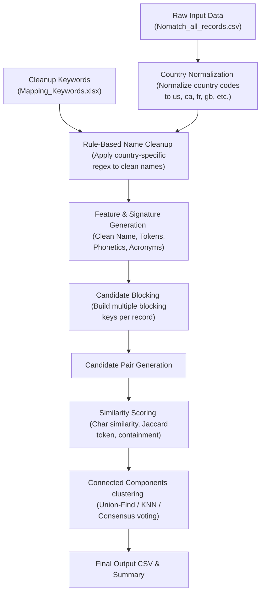

# No-Match Name Clustering POC Walkthrough

This document provides a comprehensive end-to-end technical guide to the No-Match Name Clustering Proof of Concept (POC). The goal of this project is to clean and cluster provider/customer names from no-match records country-wise, grouping duplicate entities that have spelling variations.

---

## 1. System Architecture

Below is the end-to-end pipeline for the clustering system:



---

## 2. Input Data Configuration

The data is stored under the [data](file:///c:/Users/gugul/Downloads/Matching/data) directory.
- **[Nomatch_all_records.csv](file:///c:/Users/gugul/Downloads/Matching/data/Nomatch_all_records.csv)**: Contains raw inputs `ToMatch_Name` and `ToMatch_Country`.
- **[Mapping_Keywords.xlsx](file:///c:/Users/gugul/Downloads/Matching/data/Mapping_Keywords.xlsx)**: Country-specific noise keywords to clean up (e.g. replacing `holding` or `inc` with standardized words or spaces).

### Cleaning & Prep Logic
1. **[normalize_country](file:///c:/Users/gugul/Downloads/Matching/approaches/01_basic/cluster_nomatch_records.py#L21)**: Maps country names to ISO 2-character codes (e.g., `Canada` $\rightarrow$ `ca`, `USA` $\rightarrow$ `us`).
2. **[build_country_rules](file:///c:/Users/gugul/Downloads/Matching/approaches/01_basic/cluster_nomatch_records.py#L35)**: Loads mapping keywords, sorts them by word length descending to prevent substring conflicts, and compiles country-specific regular expression pattern pairs.
3. **[fast_name_transform](file:///c:/Users/gugul/Downloads/Matching/approaches/01_basic/cluster_nomatch_records.py#L90)**: Cleans special characters, normalizes whitespace, and substitutes noise words.

---

## 3. Detailed Approach Breakdown

The system implements six different approaches under the [approaches](file:///c:/Users/gugul/Downloads/Matching/approaches) folder:

### Approach 1: Basic Clustering
* **Script**: [cluster_nomatch_records.py](file:///c:/Users/gugul/Downloads/Matching/approaches/01_basic/cluster_nomatch_records.py)
* **Strategy**: Exact clean name grouping combined with single-key blocking and SequenceMatcher fuzzy matching.
* **Blocking Key**: First token prefix (length 6) or combination of first 5 chars and second 4 chars (`token0_token1`).
* **Scoring Rules**:
  * Numeric tokens must match exactly.
  * Word tokens must have non-empty intersection (if length $> 2$).
  * Fuzzy threshold: $\ge 0.92$ (using Python's `SequenceMatcher`).
* **Clustering**: Connected components via Union-Find.

### Approach 2: Advanced Token-Based Hybrid Clustering
* **Script**: [advanced_nomatch_clustering.py](file:///c:/Users/gugul/Downloads/Matching/approaches/02_advanced/advanced_nomatch_clustering.py)
* **Strategy**: Multi-key candidate blocking, token stems, phonetics, and a hybrid scoring formula.
* **Tokens**: Generates standardized word tokens with light stemming (`ies` $\rightarrow$ `y`, trailing `s` removal).
* **Phonetics**: Soundex signature for the first 3 tokens (`Soundex_1_2_3`).
* **Blocking Keys**: Creates multiple buckets for candidate pairs:
  1. `exact`: exact clean name
  2. `signature`: alphabetically sorted tokens
  3. `first_second`: prefix of first 2 tokens
  4. `first_last`: prefix of first and last token
  5. `first_token`: prefix of first token
  6. `phonetic`: Soundex signature
* **Hybrid Scoring**:
  $$Score = \max \begin{cases} 
  1.0 & \text{if exact match} \\
  1.0 & \text{if token signature match} \\
  0.50 \cdot Jaccard + 0.30 \cdot CharRatio + 0.20 \cdot TokenSortRatio \\
  0.60 \cdot Containment + 0.40 \cdot CharRatio 
  \end{cases}$$
* **Thresholds**: Cluster match $\ge 0.90$, near-match review $\ge 0.84$.

### Approach 3: KNN-Style Similarity Graph
* **Script**: [knn_style_nomatch_clustering.py](file:///c:/Users/gugul/Downloads/Matching/approaches/03_knn_style/knn_style_nomatch_clustering.py)
* **Strategy**: Dependency-free similarity graph that connects each record to its top $K$ nearest candidates within its blocks.
* **Parameters**: `top_k = 3`, threshold $= 0.90$.
* **Clustering**: Graph component clustering using Union-Find on neighbor edges.

### Approach 4: Ensemble Consensus Clustering
* **Script**: [ensemble_nomatch_clustering.py](file:///c:/Users/gugul/Downloads/Matching/approaches/04_ensemble/ensemble_nomatch_clustering.py)
* **Strategy**: Consensus voting across Basic, Advanced, and KNN-Style.
* **Consensus Logic**: Pairwise edges are kept if $\ge 2$ algorithms vote "match".
* **Confidence Level**:
  * `very_high`: All 3 approaches agree.
  * `high`: Exactly 2 approaches agree.
* **Clustering**: Union-Find on consensus edges.

### Approach 5: TF-IDF Blocking + Union-Find
* **Script**: [tfidf_blocking_unionfind_clustering.py](file:///c:/Users/gugul/Downloads/Matching/approaches/05_tfidf_blocking_unionfind/tfidf_blocking_unionfind_clustering.py)
* **Strategy**: Pure Python TF-IDF term representation for large-scale similarity.
* **Features**: Character 3-gram and 4-gram representation.
* **Similarity**: Cosine similarity between character n-gram TF-IDF vectors.
* **Clustering**: Keep top $5$ neighbors with similarity $\ge 0.86$ per block; cluster via Union-Find.

### Approach 6: LSH MinHash + Union-Find
* **Script**: [lsh_minhash_unionfind_clustering.py](file:///c:/Users/gugul/Downloads/Matching/approaches/06_lsh_minhash_unionfind/lsh_minhash_unionfind_clustering.py)
* **Strategy**: High-scalability candidate generation for $200\text{M}+$ scale without full pairwise scoring.
* **Algorithm**:
  * **MinHash**: Extracts 3-character shingles and hashes them into $64$ signatures using stable `blake2b` hashes.
  * **LSH**: Splits signatures into $16$ bands of $4$ rows each.
  * **Scoring**: Computes hybrid Advanced scoring only for candidate pairs sharing at least one LSH bucket. Pairs $\ge 0.90$ form clusters.

---

## 4. Evaluation Suite

The evaluation scripts are stored under the [evaluation](file:///c:/Users/gugul/Downloads/Matching/evaluation) folder:
1. **[compare_clustering_approaches.py](file:///c:/Users/gugul/Downloads/Matching/evaluation/compare_clustering_approaches.py)**: Loads clustered records from all approaches, compiles statistics, writes [clustering_approach_comparison.csv](file:///c:/Users/gugul/Downloads/Matching/evaluation/clustering_approach_comparison.csv), and samples 20 clusters per method for manual auditing.
2. **[auto_label_review_sample.py](file:///c:/Users/gugul/Downloads/Matching/evaluation/auto_label_review_sample.py)**: Auto-labels the sample dataset using heuristics (like token overlaps and numeric check rules) to mimic human audit reviews.
3. **[calculate_review_metrics.py](file:///c:/Users/gugul/Downloads/Matching/evaluation/calculate_review_metrics.py)**: Analyzes manually/auto-labeled records and outputs the precision and accuracy metrics report.

---

## 5. Performance & Coverage Summary

Results based on testing the **10K record sample**:

| Approach Name | Rows Processed | Total Clusters | Multi-Record Clusters | Records Grouped | Single Records | Largest Cluster | Has Score | Has Reason |
| :--- | :---: | :---: | :---: | :---: | :---: | :---: | :---: | :---: |
| **Basic** | 10,000 | 9,251 | 471 | 1,220 | 8,780 | 21 | No | No |
| **Advanced** | 10,000 | 9,236 | 482 | 1,246 | 8,754 | 21 | Yes | Yes |
| **KNN-Style** | 10,000 | 9,236 | 482 | 1,246 | 8,754 | 21 | Yes | Yes |
| **Ensemble** | 10,000 | 9,236 | 482 | 1,246 | 8,754 | 21 | Yes | Yes |
| **TF-IDF Blocking** | 10,000 | 9,254 | 468 | 1,214 | 8,786 | 21 | Yes | Yes |
| **LSH MinHash** | 10,000 | 9,227 | 485 | 1,258 | 8,742 | 21 | Yes | Yes |

### Manual/Auto Label Accuracy Report
Based on audited cluster samples:

* **Ensemble**: $100.0\%$ Accuracy, $0.0\%$ False Positives (Safe & recommended baseline).
* **Advanced**: $100.0\%$ Decisive Accuracy, 1 cluster labeled "Needs Review".
* **LSH MinHash**: $100.0\%$ Accuracy (Maximum coverage, but requires validation to prevent drift on larger datasets).
* **Basic**: $66.67\%$ Accuracy over all reviewed (10 clusters flagged as "Needs Review" due to lack of token containment checking).

---

## 6. Execution Command Flow

Run the entire pipeline sequentially from the project root directory:

```powershell
# 1. Run all clustering approaches
python .\approaches\01_basic\cluster_nomatch_records.py
python .\approaches\02_advanced\advanced_nomatch_clustering.py
python .\approaches\03_knn_style\knn_style_nomatch_clustering.py
python .\approaches\04_ensemble\ensemble_nomatch_clustering.py
python .\approaches\05_tfidf_blocking_unionfind\tfidf_blocking_unionfind_clustering.py
python .\approaches\06_lsh_minhash_unionfind\lsh_minhash_unionfind_clustering.py

# 2. Run evaluation comparisons
python .\evaluation\compare_clustering_approaches.py

# 3. Optional: Run auto-labeling helper and compute metrics
python .\evaluation\auto_label_review_sample.py
python .\evaluation\calculate_review_metrics.py
```
